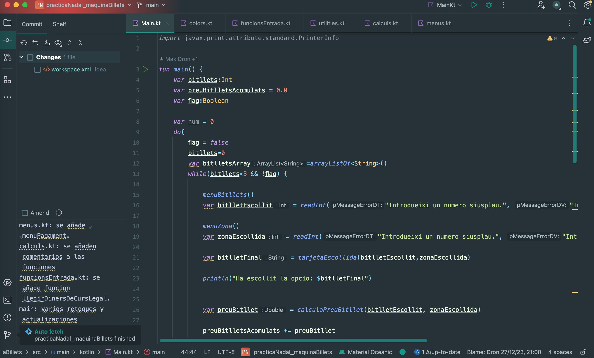
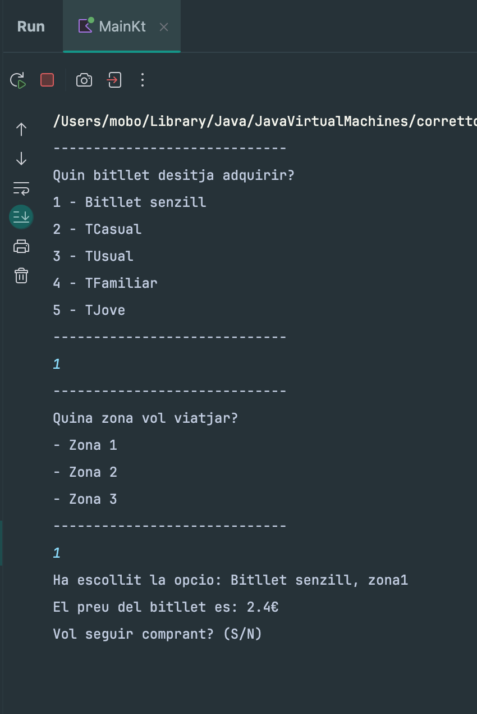

# Projecte Màquina de Bitllets

# Visió general
Màquina de bitllets és un projecte dins de l'àmbit educatiu, amb un enfocament en la programació modular i la bona documentació del codi. No obstant això, el seu principal objectiu és fomentar la col·laboració, utilitzant Git i GitHub per permetre que diverses persones treballin de manera conjunta en el mateix projecte.



<a id = "toc"></a>
# Índex
1. [Descripció del Projecte](#project-description)
2. [Com instal·lar i executar el projecte](#install)
3. [Execució del Projecte](#execution)
4. [Resum](#summary)

<a id = "project-description"></a>
# Descripció del Projecte
En executar aquesta aplicació, et trobaràs davant d'una màquina de venda de bitllets de tren, com podrien ser de FGC o rodalies. El programa et preguntarà quin tipus de bitllet vols comprar i de quantes zones, en base a això calcularà el preu. T'acceptarà el pagament amb monedes o bitllets de curs legal i, finalment, t'imprimirà un rebut si així ho desitges.

L'aplicació disposa de diversos arxius que treballen simultàniament. Un d'ells és [menus](/src/main/kotlin/menus.kt), centrat en la interacció amb l'usuari. Un arxiu [càlculs](/src/main/kotlin/calculs.kt) que emmagatzema totes les funcions relacionades amb els càlculs. Tenim [utilities](/src/main/kotlin/utilities.kt) i [funcions d'entrada](/src/main/kotlin/funcionsEntrada.kt), dos arxius que allotgen mètodes per a la recollida efectiva de dades de l'usuari. Finalment, hem afegit un arxiu [colors](/src/main/kotlin/colors.kt) que col·labora amb [utilities](/src/main/kotlin/utilities.kt) per donar un toc de color i vida a les impressions per consola. Tot això, evidentment, a part del "Main", el director principal de l'orquestra.

<a id = "install"></a>
# Com instal·lar i executar el projecte:
Aquí et mostrarem com pots instal·lar-ho i executar-ho al teu propi ordinador.

## Preparatius
Abans de començar, assegura't de tenir el següent instal·lat al teu ordinador:

- [Java Development Kit (JDK)](https://www.oracle.com/java/technologies/javase-downloads.html)
- [Kotlin](https://kotlinlang.org/docs/tutorials/command-line.html)

## Passos d'Instal·lació

1. **Clona el Repositori:**
   ```bash
   git clone https://github.com/your-username/your-project.git
   cd your-project
   ```
2. **Compila el Projecte:**
   ```bash
   kotlinc -include-runtime -d your-project.jar src/main/kotlin/*.kt
   ```
3. **Executa l'Aplicació:**
   ```bash
   java -jar your-project.jar
   ```
- Una altra opció és importar el repositori al teu IDE preferit. Per a una importació i execució òptima, es recomana utilitzar IntelliJ amb Gradle.


<a id="execution"></a>
# Execució del Projecte

Executa el projecte i segueix les instruccions que apareixen a la pantalla.



No t'amoïnis si introdueixes les dades de manera incorrecta; l'aplicació ja té tot previst per a això.


Finalment, obtindràs el resultat de la funció basat en les entrades que has proporcionat a l'aplicació.


---
<a id="summary"></a>
## Moltes Gràcies!

A llarg d'aquest projecte, la dificultat màxima residia en treballar en un sol fitxer, amb diverses persones, cadascuna des de casa seva. Això ens ha portat a necessitar una bona planificació, divisió de tasques i assignació de responsabilitats, i tot això s'ha hagut de fer de manera horitzontal ja que no hi havia un cap de projecte guiant els processos. El que al principi semblava un desafiament, al llarg del camí ens ha fet familiaritzar amb noves i intel·ligents metodologies de treball, a través de les quals hem aconseguit dur el projecte endavant en temps rècord, tenint en compte que estem en dates nadalenques.

En conjunt, l'experiència ha estat positiva amb bons resultats i aprenentatge, acostumant-nos a treballar en equip, col·laborar sense interferir-nos i superar diverses dificultats pel camí.

Happy coding!
---
[Tornar a l'Índex](#toc)
